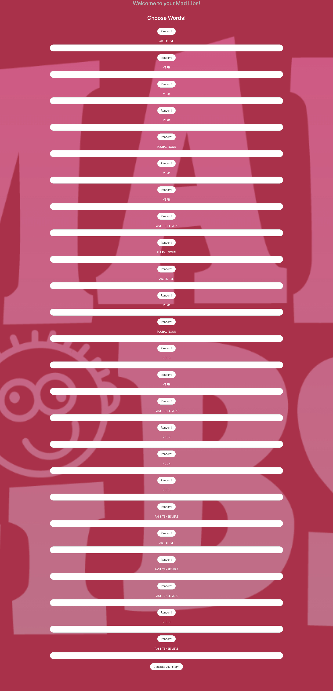
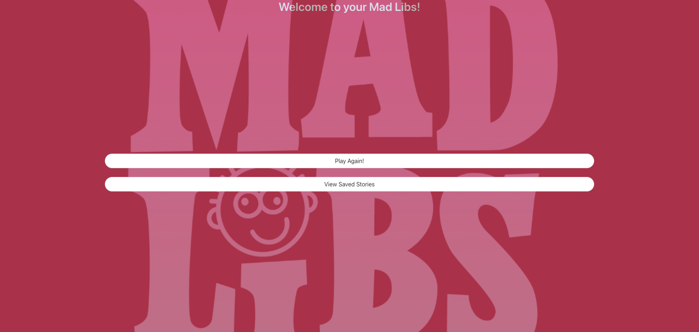

# **MadLibz Web Application**

## Table of Contents

- [Description of Project](#description-of-Project)
- [Technologies Used](#technologies)
- [Page Images](#page-images)
- [Links](#links) 
- [Known Bugs](#known-bugs)
- [Next Steps](#next-steps)
- [How to Contribute](#how-to-contribute)
- [Authors](#authors)
- [Acknowledgements](#acknowledgements)

### Description of Project

This is a whimisical web application which allows a user to:

- Start a random Mad Libs story.
- Either enter their own words or create random words based on the parts of speech.
- Render their story.
- Save their story.
- View previous saved stories using local storage.

### Technologies

- [HTML](https://html.com/)
- [CSS](https://www.w3.org/Style/CSS/Overview.en.html)
- [Bulma Css Framework](https://bulma.io/)
- [Javascript](https://www.javascript.com/)
- [JQuery](https://jquery.com/)
- [Google Fonts](https://fonts.google.com/)
- [Font Awesome](https://fontawesome.com/)
- [MadLibz API](https://madlibz.herokuapp.com/api)
- [Dictionary API](https://dictionaryapi.com/)

### Page Images

Start Page
 
 User Input Page
 
 Rendered Story
 
 End Page
 

### Links

- [Project GitHub](https://github.com/TeamMadLibz/MadLibz)
- [Deployed website](https://teammadlibz.github.io/MadLibz/)

### Known Bugs

- Some random word creation does not work.

### Next Steps

- Fix random word creation.
- Add more styling to navbar and footer.
- Find solutions so that new stories added to the API don't require extra coding steps. 

### How to Contribute

- [Contribute to the API](https://github.com/HermanFassett/madlibz/blob/master/data/templates.json)

### Authors
- Jayme Mizelle https://github.com/jaymemizelle
- Eric Jostad https://github.com/EJostad
- Ray Luna https://github.com/leon-luna-ray
- Shawn Flanigan https://github.com/Shawnmflanigan

### Acknowledgements
Thanks to Herman for engaging with us for the API development. 
